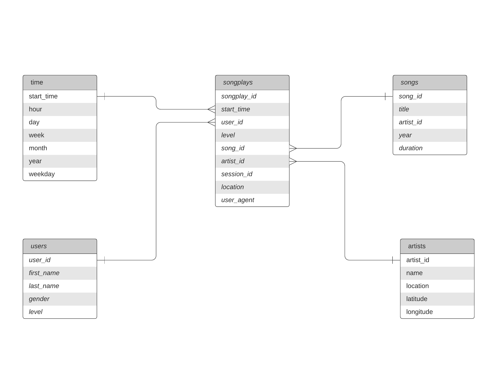

# Sparkify ETL with Postgres and Python

In this project, we'll learned on data modeling with Postgres and build an ETL pipeline using Python.

We will follow the following steps:
- Data modeling with Postgres
- Creating star schema database
- ETL pipeline using Python

## Project Description

This project is to create a SQL analytics database for a music streaming startup called Sparkify. Sparkify's analytics team want to understand what songs users are listening on the company's music app. They need an easy way to query to their data. These data are stored in raw JSON logs on user activity on the app, as well as a directory with JSON metadata on the songs in their app on.


### Project Dataset

- **Song Dataset**: files are partitioned by the first three letters of each song's track ID e.g. */data/song_data.*.json. Sample:

```
{"artist_id": "ARD7TVE1187B99BFB1", "artist_latitude": null, "artist_location": "California - LA", "artist_longitude": null, "artist_name": "Casual", "duration": 218.93179, "num_songs": 1, "song_id": "SOMZWCG12A8C13C480", "title": "I Didn't Mean To", "year": 0}
```

- **Log Dataset**: files in the dataset you'll be working with are partitioned by year and month e.g. */data/log_data.*json. Sample:

```
{"artist": "Stephen Lynch", "auth": "Logged In", "firstName": "Jayden", "gender": "M", "itemInSession": 0, "lastName": "Bell", "length": 182.85669, "level": "free", "location": "Dallas-Fort Worth-Arlington", "method": "TX PUT", "page": "NextSong", "registration": 1.540992.., "sessionId": "829", "song":"Jim Henson's Dead", "status": 200, "ts": 1543537327796, "userAgent": "Mozilla/5.0 (compatible; MSIE 10.0; Windows NT...", "userId": 91}
```

## Data Modeling

We will use the Star Schema: 
one fact table consist of the measures associated with each event *songplays*, 
and  referencing four dimensional tables *songs*, *artists*, *users* and *time*, each with a primary key that is being referenced from the fact table.

On why to use a relational database for this case:

- The data types are structured (we know before-hand the structure of the jsons we need to analyze, and where and how to extract and transform each field)
- The amount of data we need to analyze is not big enough to require big data related solutions.
- This structure will enable the analysts to aggregate the data efficiently
- Ability to use SQL that is more than enough for this kind of analysis
- We need to use JOINS for this scenario



## Project template

The data files, the project includes seven files:
1. ***create_tables.py*:** drops and creates your tables. You run this file to reset your tables before each time you run your ETL scripts.
2. ***etl.ipynb*:** reads and processes a single file from *song_data* and *log_data* and loads the data into your tables. This notebook contains detailed instructions on the ETL process for each of the tables.
3. ***etl.py*:** reads and processes files from *song_data* and *log_data* and loads them into your tables. You can fill this out based on your work in the ETL notebook.
4. ***README.md*:** provides discussion on this project.
5. ***SparkStarSchema.png*:** *ERD* for star schema of this project
6. ***sql_queries.py*:** contains all your sql queries, and is imported into the last three files above.
7. ***test.ipynb*:** displays the first few rows of each table to let us check on the database.

## How to Run

1. Run ***create_tables.py*** to create the database and tables.
2. Run ***etl.py*** to process for loading, extracting and inserting the data.
3. Run ***test.ipynb*** to confirm the creation of database and columns.